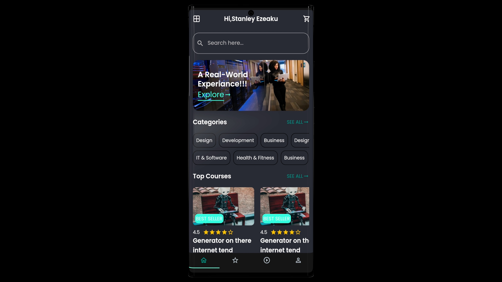
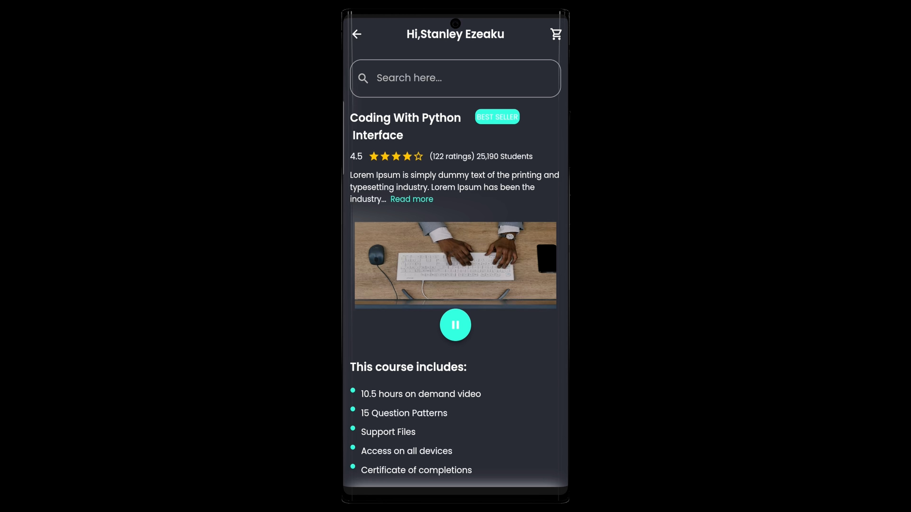
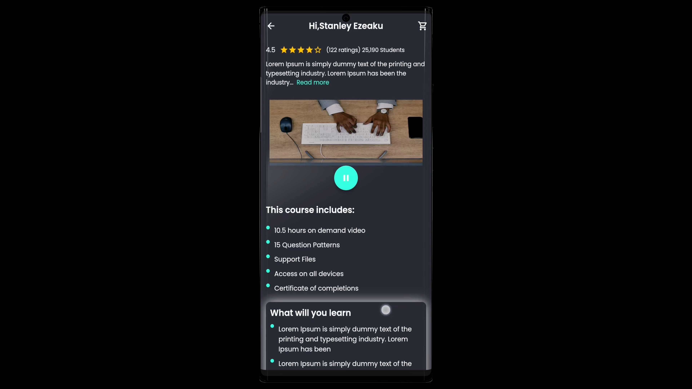
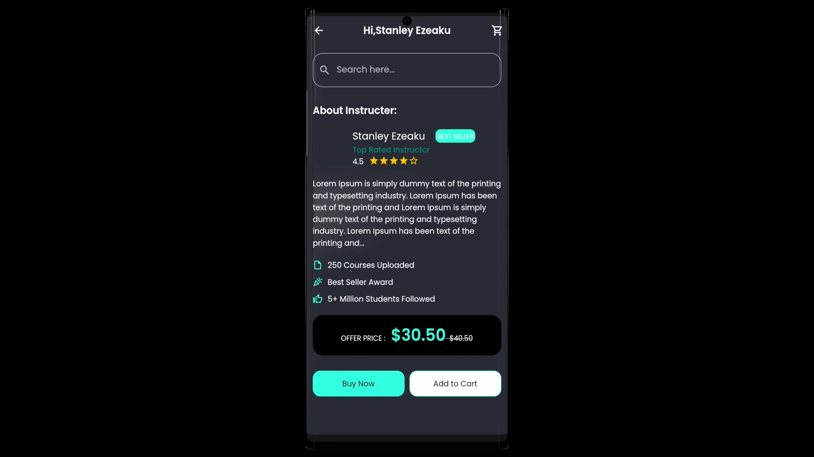
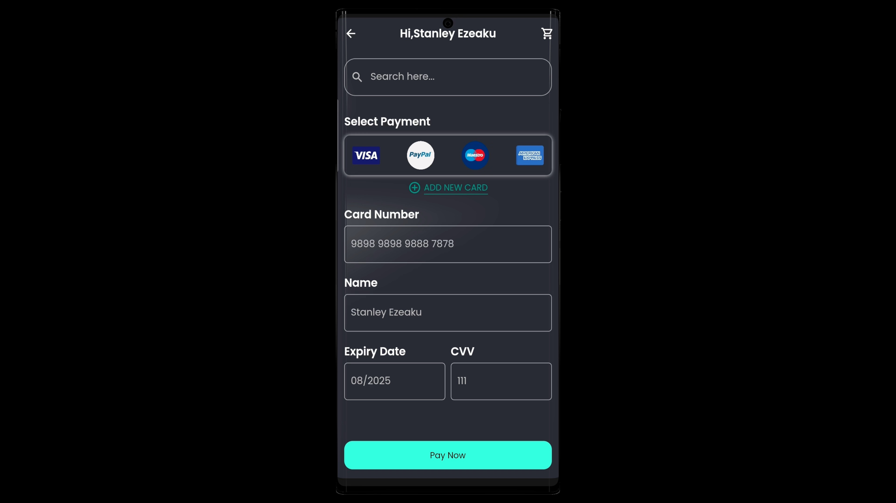
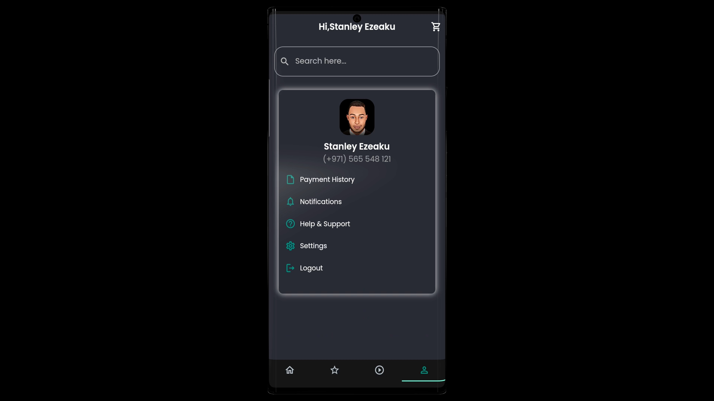
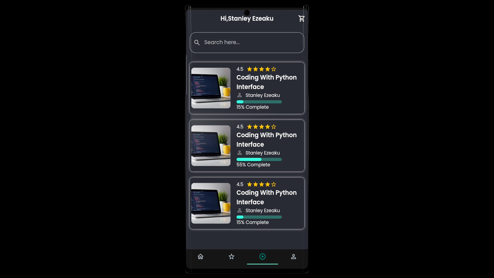
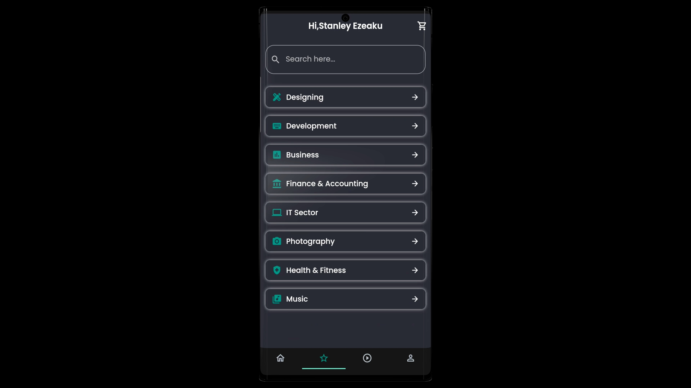

# Zlearning

An Open source E-Learning platform app, with complete screens and widgets which are reusable in your flutter projects.

## [Watch it on YouTube](https://www.youtube.com/watch?v=nvmAj3OTyyk)

**Packages we are using:**

- flutter_svg: [link](https://pub.dev/packages/flutter_svg)

### Preview

## Screens it contains:

=> Onboarding

=> Login

=> Forgot Password

=> Sign Up

=> Complete Profile

=> OTP Verification

=> Home Page

=> Product Details

=> Order

=> Profile (added)

=> Bottom Navigation Bar (added)

## Photos

